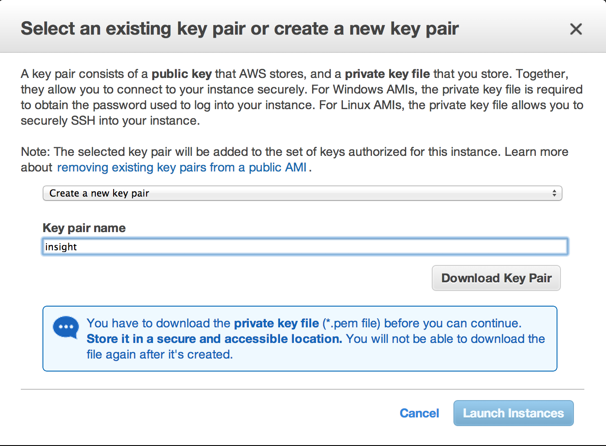

# Launching an Amazon AWS EC2 Instance

1. Create an [Amazon AWS](http://aws.amazon.com/) account and sign in. Visit this
[link](https://github.com/stormpython/insightfl/blob/master/docs/requirements.md#amazon-aws)
for account creation instructions.

2. Navigate to the `AWS Management Console`.

    

3. Click on the `EC2` icon.

    

4. Launch an EC2 instance by clicking the `Launch Instance` button.

    

5. Select the **Ubuntu Server 14.04 LTS** Free tier eligible instance.

    

6. Choose the `t1.micro` instance and click `Review and Launch`.

    

    

7. Click on `Edit Security Groups`.

    

8. We will be adding several rules to our security group. Click on `Add Rule` each time you want to add
more rules to your security group. Your security group should resemble those below. When done, click on `Review and Launch`.

    

9. **Optional**: Click on `Edit Storage`. Free tier instances allow up to 30GB of disk space.
Increase the storage space if needed and click on `Review and Launch`.

    
    

10. `Launch` your EC2 instance.

    

11. Create a new key pair, download it, then click `Launch Instances`.

    

12. You should now see a Launch Status Screen. Click on `View Instances`.

    

13. After several minutes, your EC2 instance should be running. You should also now see the Public DNS
for your EC2 instance.

    

14. Visit [Deploying to AWS](https://github.com/stormpython/insightfl#deploying-to-aws) to deploy your
web application to your EC2 instance.
